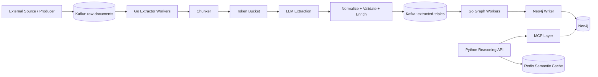

# SynapticCore Architecture

## 1. System scope

SynapticCore is organized as a polyglot microservice architecture with two major logical layers:

- **Ingestion Engine (Go):** throughput-sensitive document ingestion, chunking, LLM extraction orchestration, Kafka consumption, rate limiting, normalization, and Neo4j persistence.
- **Reasoning API (Python):** higher-level AI orchestration, graph retrieval, multi-hop reasoning, MCP integration, and semantic caching.

The development work documented so far is concentrated on the Go ingestion path.

## 2. High-level architecture



## 3. Why two ingestion stages exist

The ingestion pipeline separates extraction from graph persistence.

### Stage A: `raw-documents`

Input:

- Full document payload.
- Source/provenance information.

Processing:

1. Fetch message manually.
2. Assign message to an extractor worker.
3. Chunk the document.
4. Apply token-bucket rate limiting before LLM calls.
5. Generate a contract-first prompt.
6. Extract structured graph data.
7. Decode and validate JSON.
8. Normalize values.
9. Generate system-owned identifiers.
10. Produce one `DocumentPackage`.

Output:

```text
Kafka topic: extracted-triples
```

### Stage B: `extracted-triples`

Input:

- One serialized `DocumentPackage`.

Processing:

1. Deserialize the package.
2. Send the package to the graph writer.
3. Persist document/chunk structure.
4. Persist extracted nodes.
5. Persist relationships.
6. Persist `NEXT_CHUNK` links.
7. Complete the Neo4j transaction.
8. Commit the Kafka offset only after successful persistence.

This boundary means LLM extraction and Neo4j persistence can be scaled and controlled independently.

## 4. Ontology architecture

The canonical ontology is stored in:

```text
shared/docs/ontology-v1.yaml
```

It defines a small cross-domain vocabulary rather than allowing arbitrary graph structures.

### Abstract node types

| Type | Role |
|---|---|
| `Entity` | A concrete person, organization, object, location, or other domain entity |
| `Event` | An occurrence with temporal/state information |
| `Concept` | An idea, term, or knowledge item |
| `Instruction` | Procedural memory or strategy |

The development log also distinguishes infrastructure-owned `Document` and `Chunk` nodes.

### Generalized relationship vocabulary

Examples currently defined include:

```text
PART_OF
ASSOCIATED_WITH
DEPEND_ON
TRIGGERED_BY
MENTIONED_IN
PERFORMED_BY
```

The purpose is to keep the graph contract stable across domains.

## 5. Bi-temporal metadata

The ontology records both the time represented by a fact and the time at which the system learned or recorded it.

| Field | Ownership | Meaning |
|---|---|---|
| `uid` | System | Deterministic identity used for resolution/merging |
| `source_id` | System | Source of the extracted information |
| `confidence` | LLM | Confidence associated with extracted information |
| `t_valid` | LLM / source data | When the fact is valid in the represented world |
| `t_invalid` | LLM / source data | When the fact is invalidated |
| `t_ingest` | System | When the system ingested the data |

The critical architectural rule is that the LLM should not own deterministic infrastructure metadata.

## 6. Extraction pipeline

The Go extraction path can be represented as:

```text
Document
  │
  ├── Chunk
  │     │
  │     ├── Contract-generated prompt
  │     ├── LLM call
  │     └── JSON extraction
  │
  └── DocumentPackage
         │
         ├── normalize
         ├── validate
         ├── generate UID
         ├── generate source / ingest metadata
         └── append NEXT_CHUNK links
```

### Contract-first prompt generation

The ontology loader converts the YAML contract into Go structures.

The prompt builder uses the contract to describe:

- allowed node types,
- node fields,
- allowed relationship types,
- relationship structure,
- relevant metadata fields,
- strict JSON output requirements.

This reduces the surface area for schema drift.

## 7. Deterministic UID strategy

The UID pipeline uses normalization before hashing.

Conceptually:

```text
label + "|" + canonical name
             │
             ▼
        SHA-256
             │
             ▼
      deterministic UID
```

The development implementation includes:

- `NormalizeKey`
- `CanonicalName`
- `MakeUID`
- `SanitizeLabel`

The purpose is deterministic entity resolution and idempotent ingestion.

## 8. Chunking

The documented implementation uses chunks in an approximate target range with overlap to preserve continuity between neighboring text sections.

The development notes describe:

- approximately 500–1000 tokens/characters depending on the implementation stage,
- approximately 5–10% overlap,
- sequential chunk ordering.

The exact tokenizer and production chunk-size policy should remain configurable rather than being hard-coded into architecture documentation.

## 9. Rate limiting

LLM calls are protected by a token-bucket limiter.

The documented test used:

```text
capacity = 10
refill rate = 2 tokens/second
```

Observed behavior:

- initial burst consumed the available tokens immediately,
- later calls waited for refill,
- the limiter avoided fixed-interval busy waiting,
- waiting was adjusted to the next refill point.

The limiter uses synchronization primitives to protect shared state across goroutines.

## 10. Neo4j writer

The writer follows:

```text
Driver
  ↓
Session
  ↓
Managed transaction
  ↓
Batch Cypher operations
```

The development work explicitly moved away from issuing one write per individual graph object.

### DocumentPackage

A document package contains the graph objects derived from the whole document:

```text
DocumentPackage
├── Document
├── Chunks
├── Nodes
├── Relationships
└── NEXT_CHUNK links
```

The package is persisted through a single managed write transaction.

Neo4j describes transactions as atomic units where a failure leaves the database state unchanged:
https://neo4j.com/docs/operations-manual/current/database-internals/

## 11. Batch ingestion with `UNWIND`

The writer groups graph data and uses Cypher `UNWIND` to process collections in batches.

Conceptually:

```text
client
  │
  └── one parameter containing many rows
           │
           ▼
        UNWIND
           │
           ▼
    MERGE / CREATE / SET
```

This eliminates the need for one network round-trip per node or relationship.

## 12. Concurrency control

Kafka can cause multiple extraction workers to update the same logical graph entities concurrently.

The documented implementation therefore includes a pessimistic lock pattern using a `_lock` property on hot nodes.

The architectural intent is:

1. identify the hot node,
2. serialize conflicting updates,
3. perform the required graph mutation,
4. release the lock as part of the transaction lifecycle.

This is an application-level concurrency mechanism and should be benchmarked under realistic contention before any production guarantee is made.

Neo4j also acquires write locks automatically during transactional operations; explicit manual locking is useful only when the application's required isolation cannot be achieved through ordinary transaction behavior:
https://neo4j.com/docs/operations-manual/current/database-internals/

## 13. Neo4j constraints and indexes

The current schema initialization creates uniqueness constraints for:

```text
Entity.uid
Event.uid
Concept.uid
Instruction.uid
Document.uid
Chunk.uid
```

Additional indexes are used for common lookup properties such as:

```text
Entity.name
Concept.term
Chunk.doc_uid
```

Constraints and indexes have different responsibilities:

- **Uniqueness constraints:** enforce correctness and prevent duplicate values.
- **Indexes:** improve lookup performance where a uniqueness constraint is not the appropriate schema rule.

Neo4j documents that uniqueness constraints are backed by indexes and can avoid label-wide scans during uniqueness checks:
https://neo4j.com/docs/cypher-manual/current/schema/constraints/create-constraints/

## 14. Dynamic labels and relationship batching

The ingestion design evolved to include source and target labels in the extraction contract.

The Go writer then groups relationship work by the relevant label/type combinations before executing Cypher.

The purpose is to keep generated Cypher predictable and make index-backed lookups usable without falling back to broad scans.

Do not document this as an unconditional `O(1)` guarantee. The accurate claim is that indexed lookup is preferred over an unindexed scan.

## 15. Kafka architecture

The intended topics are:

```text
raw-documents
extracted-triples
```

The recorded local development setup uses three partitions for experimentation.

The consumer architecture is:

```text
Kafka Reader
    │
    ▼
FetchMessage(ctx)
    │
    ▼
Task Channel
    │
    ├── Worker 1
    ├── Worker 2
    └── Worker N
```

`FetchMessage` is deliberately paired with explicit offset commitment so the application controls when a message becomes acknowledged.

Kafka documents this general consume-process-store-position pattern as at-least-once processing because a crash before the position is stored can cause redelivery:
https://kafka.apache.org/41/design/design/

## 16. Offset commit contract

The intended ordering is:

```text
1. Fetch message
2. Process document
3. Persist graph successfully
4. Commit Kafka offset
```

Not:

```text
1. Fetch message
2. Commit offset
3. Process document
```

The second ordering can acknowledge work before the actual graph persistence succeeds.

### Failure handling

Recoverable failure:

```text
processing failure
    ↓
do not commit offset
    ↓
Kafka redelivery
```

Non-recoverable payload failure:

```text
invalid payload
    ↓
log / dead-letter handling
    ↓
commit or otherwise quarantine deliberately
```

A production dead-letter implementation should be documented separately once it exists in code.

## 17. Graceful shutdown

The Go process creates a signal-aware context:

```text
context.Background()
        │
        └── signal.NotifyContext
                ├── os.Interrupt
                └── SIGTERM
```

That context is propagated through Kafka fetches and graph operations.

On shutdown:

```text
cancel context
     ↓
FetchMessage returns
     ↓
stop fetch loop
     ↓
close task channel
     ↓
workers finish outstanding work
     ↓
WaitGroup completes
     ↓
service exits
```

The recorded development work explicitly fixed a bug where a canceled context was followed by `continue`, causing the fetch loop to spin repeatedly and consume excessive CPU.

## 18. Reasoning layer

The repository structure defines a Python reasoning API containing:

- FastAPI endpoints,
- ontology models,
- graph reasoning,
- MCP integration,
- Redis semantic caching,
- Cypher/query tooling.

The role of this layer is distinct from the Go ingestion engine:

```text
Go
----
ingest → extract → normalize → persist


Python
------
query → retrieve → reason → answer
```

This separation prevents the write-heavy ingestion path from being coupled to interactive reasoning workloads.

The current development log should not be used as evidence that the Python reasoning layer is fully implemented or production-tested.

## 19. MCP boundary

The documented design uses MCP to expose graph capabilities to an AI system.

The MCP specification defines servers around three core primitives:

- prompts,
- resources,
- tools.

Official reference:
https://modelcontextprotocol.io/specification/draft/server/index

The SynapticCore MCP boundary is intended to expose controlled retrieval and reasoning-related operations rather than arbitrary database mutation.

## 20. Security boundary

A key documented principle is that graph retrieval tools should be read-only where mutation is not required.

The retrieval tool should:

- reject destructive Cypher,
- enforce a timeout,
- sanitize output,
- truncate excessive results.

This protects the graph from accidental mutation and protects the model context window from uncontrolled result growth.

## 21. Current failure boundary

The latest recorded blocker is not Neo4j persistence.

The current failure is Kafka startup/topic initialization:

```text
Kafka integration test
        │
        ├── producer attempts write
        │
        └── Unknown Topic Or Partition
```

A topic-initialization Compose service was introduced, but the current implementation can wait indefinitely for the broker.

Until the broker readiness and topic-provisioning lifecycle are corrected, the full asynchronous ingestion path should be considered incomplete.

## 22. Architectural invariants

These are the rules the implementation should preserve:

1. The ontology is the source of truth for graph shape.
2. LLM output is never accepted without validation.
3. System-owned identifiers are generated outside the LLM.
4. Document and chunk identity are deterministic.
5. Graph persistence should be idempotent.
6. Complete document packages should be written atomically.
7. Kafka offsets are acknowledged only after downstream success.
8. Context cancellation must terminate worker loops.
9. Unbounded graph results must not be passed directly into an LLM.
10. Verified behavior and planned architecture must remain clearly distinguished.
